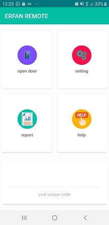

# smartDooropener
The user can open every security door without using hardware key through the device WIFI. Really, Android app connect to a WIFI modeule via TCP/IP protocol. Android app is client and WIFI module is server that answers the client's requests.The user can get some reports from last connection or blocked devices.Moreover, the user can determine who can open the door and who can't.
Socket Programming has been used for communication between server and client.
Architecture of Android app is MVP.
ESP8266 code hasn't been included here.
 
